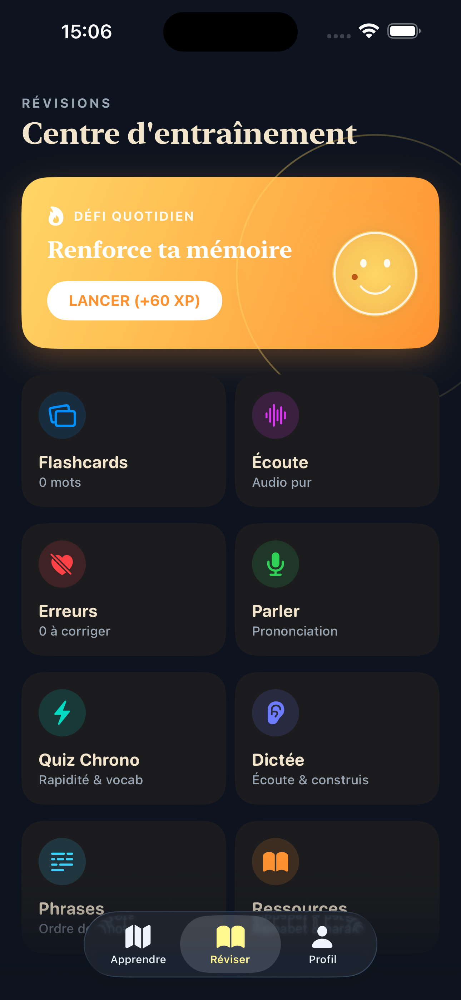
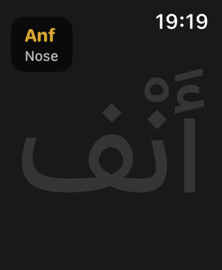

# Noorine 🌙

Hi there! I created Noorine because I wanted a simple, stress-free app to learn Arabic. No frustrating "lives" system, no hidden subscriptions, and zero ads. Just open the app and start learning.

This project is 100% free and open-source. Feel free to explore the code!

  
  

## Features

- **Zero punishment:** You're allowed to make mistakes. There are no hearts or lives to recharge.
- **Fully unlocked:** No content is hidden behind a paywall. Everything is available right away.
- **Apple Watch support:** Practice drawing letters directly on your wrist!
- **Interactive Widgets:** Keep track of your progress and daily streak right from your home screen.

## Tech Stack

If you're curious about the code, the app is built with:

- SwiftUI (iOS 17.0+)
- WatchKit (watchOS 10.0+)
- WidgetKit
- Feature-based modular architecture

## Download

[Download on the App Store](https://apps.apple.com/fr/app/noorine/id6759193799)
